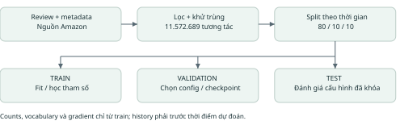
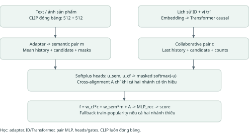
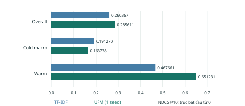
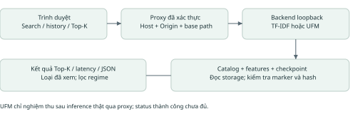
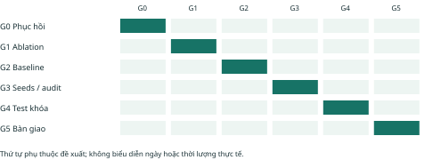

# UFM-Rec
## Đề xuất nghiên cứu và kế hoạch hoàn thiện

**Hệ khuyến nghị sản phẩm cold-start kết hợp đặc trưng nền tảng đa phương thức và độ tin cậy học được.**

Phiên bản 2.0 | Ngày 02/10/2026 | Amazon Reviews 2023 - Toys & Games

### Tóm tắt

Dự án nghiên cứu cách phối hợp lịch sử tương tác và nội dung văn bản/ảnh để gợi ý sản phẩm có ít hoặc chưa có tương tác. UFM-Rec sử dụng CLIP đóng băng, adapter đa phương thức, nhánh ID với Transformer causal và hai head ước lượng độ tin cậy. Cổng UGAF kết hợp hai nhánh theo từng cặp người dùng - sản phẩm. Đây là thiết kế thực nghiệm của dự án; tính mới và lợi ích cần được kiểm chứng qua đối chứng, ablation và đánh giá thống kê.

Dữ liệu đã xử lý gồm **11.572.689 tương tác**, catalog **767.045 sản phẩm**. CLIP đã trích đủ catalog; UFM full đã hoàn tất 12 epoch. Trên validation 40.000 trường hợp, UFM đạt NDCG@10 overall 0,285611 và cold macro 0,163738. TF-IDF đạt tương ứng 0,260367 và 0,191270. Kết quả hiện tại cho thấy cải thiện overall nhưng chưa đạt mục tiêu vượt baseline trên cold-start.

Đề xuất này xác định rõ kiến trúc đang có, phần đã nghiệm thu và phần còn phải làm: bảy ablation, baseline tuần tự/concat, nhiều seed, calibration UFM, dataset thứ hai, đo tài nguyên, test cuối và demo UFM. Không quy đổi các hạng mục thành phần trăm hoàn thành tùy ý.

### Cách đọc tài liệu

| Phần | Nội dung |
| --- | --- |
| 1-2 | Bài toán, câu hỏi nghiên cứu và nghiên cứu liên quan |
| 3-5 | Dữ liệu, kiến trúc, phương trình và huấn luyện |
| 6-7 | Giao thức đánh giá và ma trận thí nghiệm |
| 8-9 | Kết quả đã có và tiến trình thực tế |
| 10-11 | Demo, vận hành, kế hoạch hoàn thiện và rủi ro |
| 12 | Tài liệu tham khảo và nguồn kiểm chứng |

**Phạm vi bằng chứng:** số liệu UFM lấy từ báo cáo FITLAB ngày 02/10; cấu trúc mô hình lấy từ mã nguồn. Giá trị mặc định CLI không được coi là bằng chứng cấu hình của một checkpoint nếu chưa đối chiếu config.json. Baseline cổ điển đã từng có kết quả test; chiến dịch UFM chưa đánh giá test.

<!-- page -->
## 1. Bài toán và mục tiêu nghiên cứu

### 1.1 Định nghĩa

Cho lịch sử tương tác dương H(u,t) trước thời điểm t và tập sản phẩm khả dụng C(t), học hàm s(u,i) để xếp hạng Top-K sản phẩm chưa xuất hiện trong lịch sử. Sản phẩm được phân nhóm theo số tương tác trong train: zero-shot = 0; extreme-cold = 1-5; cold = 6-20; warm > 20. Cold-start ở đây chủ yếu là **item cold-start**; empty-history được xử lý bằng fallback nhưng chưa là một nghiên cứu user cold-start riêng.

### 1.2 Câu hỏi và tiêu chí kiểm chứng

| Câu hỏi | Giả thuyết cần kiểm tra | Bằng chứng cần có |
| --- | --- | --- |
| RQ1: Nội dung có giúp item cold-start? | CLIP text/image cung cấp thông tin khi ID chưa học | So TF-IDF, ID-only, semantic-only; báo từng regime |
| RQ2: Gate độ tin cậy có ích? | Gate exp(-u) tốt hơn gate học thông thường/fixed fusion | Full so no_uncertainty và fixed_fusion, cùng seed/protocol |
| RQ3: Cross-alignment có ích? | Tương tác hai nhánh cải thiện xếp hạng | Full so no_cross_align; xem thay đổi theo regime |
| RQ4: Proxy có phản ánh sai số? | u cao gắn với lỗi lớn hơn | Reliability, ECE/NLL/Brier, phân nhóm u và missing modality |
| RQ5: Chi phí có phù hợp? | Frozen encoder + adapter có trade-off khả dụng | Latency, RAM/VRAM, throughput; đối chứng feature-only/adapter |

**Mục tiêu chính:** cold macro NDCG@10. Mục tiêu phụ: Recall@10, MRR@10, warm/overall, calibration và tài nguyên. Chỉ kết luận cải thiện khi thực nghiệm cùng giao thức và độ bất định thống kê ủng hộ; không đặt ngưỡng thắng sau khi đã xem test.

### 1.3 Đóng góp dự kiến

- Pipeline temporal có manifest, train-only counts, history kiểm tra timestamp, candidate set dùng chung và khả năng tái lập.
- Thiết kế phối hợp đặc trưng đa phương thức với biểu diễn tuần tự, có mask khi ID/modality không khả dụng.
- Phân tích thành phần bằng bảy ablation và đánh giá riêng bốn mức cold-start.
- Demo Top-K có thông tin backend, xuất JSON và quy trình khôi phục job từ checkpoint.

Những nội dung trên là đóng góp dự kiến và sản phẩm kỹ thuật. Chưa tuyên bố state-of-the-art, posterior Bayes, tách epistemic/aleatoric uncertainty hoặc xác suất mua hàng đã được hiệu chuẩn.

<!-- page -->
## 2. Cơ sở khoa học và vị trí của đề tài

| Nguồn gốc | Ý chính liên quan | Vai trò trong UFM-Rec |
| --- | --- | --- |
| BPR, Rendle et al., UAI 2009 [2] | Tối ưu thứ tự cặp positive/negative cho implicit feedback | Loss ranking; baseline BPR-MF |
| SASRec, Kang & McAuley, ICDM 2018 [3] | Self-attention cho chuỗi tương tác | Động cơ nhánh causal; baseline hiện có là bản thích nghi |
| BERT4Rec, Sun et al., CIKM 2019 [4] | Masked-item learning với encoder hai chiều | Baseline dự kiến, chưa được triển khai/benchmark full |
| CLIP, Radford et al., ICML 2021 [5] | Biểu diễn ảnh - văn bản học từ giám sát ngôn ngữ | Encoder text/image đóng băng; không fine-tune LoRA |
| MMGCN, Wei et al., ACM MM 2019 [6] | Học biểu diễn theo modality với đồ thị tương tác | Related work đa phương thức; UFM hiện không dùng GCN |
| Guo et al., ICML 2017 [7] | Đánh giá calibration và temperature scaling | Phương pháp audit confidence; không suy ra mua hàng thực tế |
| Krichene & Rendle, KDD 2020 [8] | Sampled metrics có thể không giữ thứ tự mô hình như exact metrics | Giới hạn của candidate set 100; cần audit catalog |

### Khoảng trống thực nghiệm

Tín hiệu ID suy yếu khi sản phẩm ít tương tác; nội dung có thể hỗ trợ nhưng chất lượng ảnh/văn bản không đồng đều. Cần kiểm tra liệu cổng phối hợp có học được khi nào tin từng nguồn, thay vì mặc định rằng head uncertainty có ý nghĩa. Các nghiên cứu trên cung cấp nền tảng, không chứng minh tổ hợp đang triển khai tự động tốt hơn.

### Phân biệt khái niệm

**Foundation model:** CLIP pretrained được ghim revision, xuất hai vector 512 chiều. **Adapter:** lớp nhỏ học từ train để biến đổi features sang không gian gợi ý. **Uncertainty:** proxy dương được giám sát bằng residual của nhánh trên candidate sampled. **UGAF:** phép phối hợp theo exp(-u), cộng thành phần cross-alignment.

Baseline BPR-MF là ID-only. SASRec trong repo là implementation thích nghi với temporal protocol, không nhận là reproduction chính thức của bài báo. MMGCN chỉ được dùng để đối chiếu thiết kế; không đưa kết quả bài gốc vào bảng so sánh trực tiếp vì khác dữ liệu và giao thức.

Các tài liệu [1]-[8] được kiểm tra qua trang dataset, kỷ yếu PMLR, arXiv của tác giả hoặc trang nghiên cứu của tác giả/tổ chức. Liên kết đầy đủ và cách sử dụng nằm ở phần 12.

<!-- page -->
## 3. Dữ liệu và kiểm soát rò rỉ

Nguồn [1]: Amazon Reviews 2023, Toys & Games. Số liệu dưới đây thuộc bản dữ liệu local của dự án, không phải toàn bộ Amazon Reviews 2023.

| Chỉ tiêu | Giá trị |
| --- | --- |
| Review gốc | 16.260.406 |
| Positive verified trước khử trùng | 11.694.415 |
| Bản ghi trùng chính xác bị loại | 121.726 |
| Tương tác giữ lại / người dùng | 11.572.689 / 6.158.534 |
| Train / validation / test | 9.258.647 / 1.159.827 / 1.154.215 |
| Catalog / item xuất hiện trong train | 767.045 / 584.846 |
| Mốc bắt đầu validation / test, UTC | 11/08/2021 / 16/07/2022 |

Chỉ giữ verified_purchase=true và rating >= 4. Loại trùng theo user, parent item, rating, timestamp. Split toàn cục theo thời gian ở ranh giới ngày UTC, xấp xỉ 80/10/10; không chia ngẫu nhiên rồi tạo lịch sử. Các sự kiện cùng timestamp không nhìn thấy nhau.

Pipeline lịch sử giữ tối đa 50 tương tác; mô hình UFM dùng tối đa 20 mục với right-padding. Test history theo giao thức online-style có thể gồm sự kiện train/validation trước thời điểm dự đoán; cần công bố rõ điều này khi đánh giá cuối.

TF-IDF vocabulary fit trên item train. Features không dùng rating_number, average_rating, review text hoặc thống kê validation/test. Counts phân regime chỉ lấy train. Metadata catalog là snapshot: thời điểm tồn tại/chỉnh sửa nội dung có thể khác thời điểm tương tác; đây là giới hạn cần audit, không được khẳng định đã loại mọi temporal leakage.

Nguồn kiểm tra: data/processed/toys_games_full_temporal/split_manifest.json; prepare_full_temporal.py; build_recommender_samples.py; prepare_ufm_catalog.py.

<!-- page -->
## 4. Kiến trúc mô hình đang triển khai

### Nhánh semantic

CLIP ViT-B/32 nhận văn bản và ảnh, trả t(i), v(i) thuộc R^512 đã chuẩn hóa. Cửa sổ text là 77 token; mô tả dài bị cắt. Hai mask modality được ghép với vector, tạo đầu vào 1026 chiều. Adapter Linear(1026,256) - GELU - Linear(256,128) - LayerNorm và L2 normalization tạo z(i). Thiếu modality thì vector tương ứng được zero trước adapter.

Biểu diễn người dùng semantic là trung bình z của lịch sử có nội dung, sau đó chuẩn hóa. MLP pair nhận [user; item; user*item; hai mask modality], đầu vào 386 chiều khi d=128. Nhánh này phụ thuộc candidate nhưng không dùng attention cho pooling lịch sử semantic.

### Nhánh collaborative

ID embedding và positional embedding có d=128. Transformer causal mặc định 2 lớp, 4 head, feed-forward 512, history 20. Lấy vị trí cuối cùng có tương tác làm biểu diễn user. MLP pair nhận [user; item; user*item; log(1+history_length); log(1+train_count)]. ID dropout mặc định 0,5 trong train.

Item chưa có trong train được ánh xạ padding trước lookup; không dùng embedding chưa học. Nhánh CF chỉ khả dụng khi lịch sử và candidate có tín hiệu ID. Cấu hình trên là mặc định mã nguồn; file config.json của từng run là nguồn chính thức khi tái lập.

### Hợp đồng tensor

ID 0 là padding; item row r có ID r+1. Text/image table có shape [767046,512], float16 trên đĩa; mask [767046,2]; counts int64 [767046]. Batch features chuyển float32 cho adapter. Encoder không nhận gradient. Chi tiết thực thi: src/ufm_model.py.

<!-- page -->
## 5. Fusion, hàm mất mát và huấn luyện

Ký hiệu c và m là vector cặp của nhánh collaborative và semantic; a là mask nhánh khả dụng. Các phương trình sau mô tả implementation, không là trích nguyên văn một bài báo.

### 5.1 Độ tin cậy và UGAF

u_cf = Softplus(MLP_cf(c)); u_sem = Softplus(MLP_sem(m)).

w = masked_softmax([-u_cf, -u_sem], a). Nhánh không khả dụng nhận trọng số 0; nếu chỉ một nhánh khả dụng thì trọng số của nhánh đó bằng 1.

A = sigmoid(MLP_gate([c;m])) * Linear([c;m]); A chỉ hoạt động khi cả hai nhánh khả dụng.

f = w_cf*c + w_sem*m + A; s(u,i) = MLP_rec(f).

Nếu cả hai nhánh không có tín hiệu, dùng log(1+train_count) làm fallback. Các điểm số là score xếp hạng, không phải xác suất. Cross-alignment ở đây là vector bổ sung có gate, khác với attention chéo giữa hai chuỗi.

### 5.2 Objective

L = L_BPR + lambda_align*L_align + lambda_unc*L_unc + lambda_cal*L_cal.

| Thành phần | Cách tính trong mã |
| --- | --- |
| L_BPR | Mean softplus(s_negative - s_positive), chỉ negative hợp lệ |
| L_align | Mean(1 - cosine(c,m)), chỉ cặp có cả hai nhánh |
| L_unc | MSE giữa u và stop_gradient((sigmoid(s_branch)-y)^2) |
| L_cal | BCEWithLogits(s,y) trên positive/negative sampled hợp lệ |

Lambda mặc định: 0,01; 0,01; 0,1. Việc có L_cal không đảm bảo confidence đã calibrated. Residual phụ thuộc quy tắc lấy mẫu và tỷ lệ positive/negative; cần đánh giá calibration độc lập với loss train.

### 5.3 Quy trình tối ưu và resume

Mặc định CLI: AdamW, lr=0,0003, weight decay=0,0001, batch=256, 8 negative/train case, seed=42, tối đa 20 epoch, patience=3, checkpoint mỗi 1000 bước, AMP bật. Các negative loại positive train đã biết của user; không đọc nhãn test để lọc train. Run lưu model, optimizer, GradScaler, RNG, cursor và loss tích lũy; kiểm tra fingerprint trước resume.

Best checkpoint chọn bằng cold macro NDCG@10 validation. AMP overflow được skip update và hạ scale; cần ghi số lần skip thay vì coi optimizer đã cập nhật mọi batch. Không đổi code/config giữa run để tránh phá kiểm tra tái lập.

<!-- page -->
## 6. Giao thức đánh giá và thống kê

### 6.1 So sánh chính

Dùng chung split, mapping, histories, candidates và seed sampling. Validation cố định 40.000 trường hợp, mỗi trường hợp 1 positive và 99 negative. Phân nhóm theo train_count của positive. Mọi bảng phải ghi split, kích thước candidate set, sample count, seed và quy tắc chọn checkpoint.

Với một positive có rank r: Recall@K = I(r<=K); NDCG@K = I(r<=K)/log2(r+1); MRR@K = I(r<=K)/r. Cold macro là trung bình không trọng số NDCG của zero-shot, extreme-cold, cold. Overall được tính trên bộ mẫu, không mặc nhiên phản ánh phân bố traffic sản phẩm thật.

### 6.2 Kế hoạch nhiều seed và khoảng tin cậy

Đã có BPR-MF seeds 42,7,2026. Dự kiến dùng cùng bộ seed cho UFM và các baseline quan trọng. Báo mean và sample standard deviation, ghi rõ n=3. Khoảng tin cậy chênh lệch đề xuất: paired bootstrap theo user trên cùng predictions, 2000 lần lấy mẫu, percentile 95%; nhóm theo user để giảm giả định các tương tác độc lập. Đây là kế hoạch, chưa có CI UFM.

### 6.3 Calibration và giải thích

Dùng softmax trong candidate set để tính top-1 ECE (15 bins), NLL và multiclass Brier. Temperature fit trên phần validation sớm; audit phần muộn tách biệt. Báo reliability diagram, số mẫu mỗi bin, xử lý tie đồng đều. Phân tích thêm phân bố w_cf/u theo regime và tình trạng thiếu ảnh.

TF-IDF đã có audit 20.000 + 20.000 validation; ECE từ 0,168601 xuống 0,116684. Kết quả này chỉ dành cho baseline và sampled candidates, chưa chứng minh calibration UFM.

### 6.4 Kiểm soát test và exact ranking

Baseline cổ điển TF-IDF/SVD/RRF đã từng được đánh giá test; vì vậy không gọi toàn bộ test là chưa từng quan sát. Chiến dịch UFM chưa mở test và tiếp tục chọn cấu hình bằng validation. Trước test cuối: ghi manifest khóa checkpoint, hash, config, seed và candidate protocol; công bố việc test baseline đã được xem trong lịch sử dự án.

Theo [8], sampled metrics không bảo đảm giữ thứ hạng mô hình như full-catalog metrics. Đề xuất bổ sung audit exact ranking trên tập user/case cố định nếu tài nguyên cho phép; ghi rõ kích thước và điều kiện. Demo quét catalog không thay thế benchmark exact ranking.

<!-- page -->
## 7. Ma trận thí nghiệm cần hoàn thiện

| Nhóm | Run/đối chứng | Trạng thái và mục đích |
| --- | --- | --- |
| Baseline nội dung | Popularity, TF-IDF | Có kết quả; mốc đơn giản bắt buộc |
| Baseline ID | SVD, BPR-MF | Có kết quả; BPR-MF 3 seed validation |
| Baseline tuần tự | SASRec, BERT4Rec | SASRec có code/test; chưa benchmark full; BERT4Rec còn triển khai |
| Hybrid | RRF, feature concatenation | RRF có kết quả; concat còn triển khai |
| Mô hình chính | full | Hoàn tất 12 epoch; best epoch 9 |
| Nhiều seed / dataset 2 | UFM và baseline chính | Chưa hoàn tất; kiểm tra ổn định và khả năng khái quát |

### Bảy ablation seed 42

| Variant | Thành phần thay đổi | Câu hỏi |
| --- | --- | --- |
| no_uncertainty | Gate học thông thường; không train uncertainty loss | Proxy có ích hơn gate học trực tiếp? |
| fixed_fusion | Trọng số cố định, xử lý mask một nhánh | Cần fusion thích nghi theo candidate? |
| no_cross_align | Bỏ vector A; còn loss alignment | Cross-term có ích độc lập? |
| semantic_only | Tắt CF | Nội dung đủ đến đâu? |
| collaborative_only | Tắt semantic | Giá trị của tín hiệu hành vi? |
| text_only | Mask ảnh | Đóng góp của văn bản? |
| image_only | Mask văn bản | Đóng góp của ảnh? |

Suite tạo run mới, không mượn checkpoint full; kế thừa hyperparameters, dữ liệu, versions và selection protocol. Chạy tuần tự một GPU, chờ GPU chia sẻ rảnh qua hai lần kiểm tra. Fixed_fusion vẫn có cross-alignment; no_cross_align không đồng nghĩa bỏ L_align. Cần mô tả đúng để diễn giải kết quả.

### Thử nghiệm tiếp theo sau ablation

Ưu tiên kiểm tra nguyên nhân extreme-cold thấp: missing modality, độ dài text, train frequency, ID dropout và trọng số gate. Chỉ tuning trên validation với budget công bố trước. Nếu semantic-only/TF-IDF tốt hơn cold macro, báo kết quả đó và giới hạn mô hình, không chọn biểu đồ chỉ thuận lợi cho UFM.

Dataset thứ hai chưa chọn; cần giữ bài toán sản phẩm và xác nhận đủ metadata ảnh/văn bản, quy mô phù hợp tài nguyên. Không gộp các metric khác dataset thành một con số thắng chung.

<!-- page -->
## 8. Kết quả thực nghiệm đã có

| NDCG@10 validation | TF-IDF | UFM best epoch 9 |
| --- | --- | --- |
| Overall | 0,260367 | 0,285611 |
| Cold macro | 0,191270 | 0,163738 |
| Zero-shot | Chưa trích trong snapshot này | 0,188403 |
| Extreme-cold | Chưa trích trong snapshot này | 0,113300 |
| Cold | Chưa trích trong snapshot này | 0,189511 |
| Warm | 0,467661 | 0,651231 |

UFM tăng overall 0,025244 điểm tuyệt đối (khoảng 9,70% tương đối), giảm cold macro 0,027532 điểm (khoảng 14,39%), tăng warm 0,183570 điểm (khoảng 39,25%). Chưa có nhiều seed/CI cho UFM nên chưa kết luận ý nghĩa thống kê.

BPR-MF 3 seed có cold macro trung bình 0,013602 ± 0,000233 và overall 0,135465 ± 0,000231; ± là độ lệch chuẩn mẫu, không phải khoảng tin cậy. Không so mean nhiều seed của BPR với một seed UFM như bằng chứng đã kiểm soát hoàn toàn biến thiên.

**Diễn giải:** mô hình phối hợp học tốt nhóm warm trong bộ mẫu này, nhưng mục tiêu cold-start chính chưa vượt TF-IDF. Ablation cần xác định thành phần nào làm suy giảm cold macro. Không có dữ liệu per-epoch đầy đủ local để vẽ learning curve trung thực; tài liệu không dựng đường loss/metric giả.

Nguồn: reports/Tien_do_UFM_2026-10-02.md; reports/BPR_MF_multiseed_2026_09_30.json. Các số UFM là snapshot quan sát trên FITLAB; cần lưu bản metric/config chính thức khi chốt báo cáo cuối.

<!-- page -->
## 9. Tiến trình và bằng chứng nghiệm thu

| Mốc | Việc đã thực hiện | Bằng chứng / giới hạn |
| --- | --- | --- |
| 28/09 | Hoàn thành đối chứng Transformer; triển khai UFM core và queue | Báo cáo/kiểm thử kỹ thuật; chưa là chất lượng UFM |
| 30/09 | BPR-MF 3 seed, calibration TF-IDF, demo baseline | JSON metrics và acceptance report |
| 01/10 | Khôi phục extraction/AMP; watchdog và auto task | Recovery logs, checkpoint; phụ thuộc container/storage |
| 02/10 07:59 | CLIP và UFM full hoàn tất | CLIP 767.045; UFM 12 epoch; best epoch 9 |
| 02/10 18:04 | Workspace EIO, demo UFM Bus error | Inference UFM chưa nghiệm thu; nguyên nhân SIGBUS chưa xác định |
| 02/10 18:23 | Mount đọc lại được; watchdog/supervisor phục hồi | Ablation chờ GPU 100% utilization; trống 1.018 MiB |

### Phân biệt hoàn tất và còn thiếu

**Đã hoàn tất có bằng chứng:** pipeline temporal; features CLIP toàn catalog với 758.692 ảnh OK; baseline cổ điển; BPR-MF ba seed; UFM full theo completion marker; demo TF-IDF và API kiểm thử local.

**Đã có mã nhưng chưa đủ nghiệm thu:** suite bảy ablation, SASRec, demo UFM qua FITLAB proxy, resume khi hạ tầng gặp sự cố. Mã chạy được trong kiểm thử không thay thế benchmark full và thử inference thật.

**Còn phải triển khai/đánh giá:** BERT4Rec, concat hybrid, nhiều seed UFM, dataset thứ hai, calibration UFM, VRAM 16GB, kiểm thử tài nguyên, test UFM cuối, báo cáo tổng kết và slide.

### Chỉ số tiến độ có thể đếm

CLIP: 767.045/767.045 item; ảnh đọc được 758.692 (98,91%). Training UFM: hoàn tất ở epoch 12 theo early stopping, best epoch 9; không yêu cầu chạy đủ max 20 epoch. Ablation: chưa có variant hoàn tất theo marker được đọc trong đợt rà soát này. Không lấy 12/20 làm phần trăm hoàn thành train.

Mọi trạng thái tiến trình cần thời gian heartbeat và PID thực; không dùng file JSON cũ để tuyên bố job còn sống. Phiên bản báo cáo này trình bày kết quả đã ghi nhận, không là màn hình giám sát realtime. Trạng thái cập nhật sau phát hành nằm trong reports/progress.md và lệnh python status.py trên FITLAB.

<!-- page -->
## 10. Demo và vận hành đáng tin cậy

### Kịch bản trình bày

1. Mở Start_Demo.cmd hoặc URL proxy đã cấu hình. Status phải chỉ rõ TF-IDF hay UFM, số item và giới hạn history.
2. Tìm sản phẩm, thêm lịch sử, chọn zero-shot và Top 5/10. Kiểm tra không trả lại item đã xem và mọi kết quả thỏa regime.
3. Xem ảnh/tên sản phẩm, train_count, latency và score; xuất JSON gồm backend/request/results. Không gắn score thành phần trăm mua hàng.
4. Thử empty-history, thiếu ảnh, payload sai, origin sai và hai request đồng thời; bảo đảm fallback hoặc thông báo lỗi rõ ràng.

### Proxy và bảo mật

Server bind loopback; origin HTTPS được khai báo chính xác. code-server loại /proxy/port khỏi đường dẫn trước khi chuyển tiếp [9]; handler cần nhận cả đường dẫn đã loại prefix và đường dẫn giữ prefix. HTML vẫn dùng base path để trình duyệt gửi API đúng. Origin/Host checks không được bỏ để giải quyết lỗi proxy.

### Khôi phục campaign

Watchdog -> supervisor -> CLIP -> UFM -> ablation; mỗi thành phần có khóa chống trùng. Nếu GPU chia sẻ đang bận thì chờ; không dừng job khác. Nếu storage EIO thì xác minh mount, marker, checkpoint và log trước khi resume. Completion marker cùng fingerprint quyết định bỏ qua stage đã xong.

SIGKILL và SIGBUS không tự chứng minh OOM. Cần log hệ thống, memory counters, storage health và log ứng dụng. Watchdog trong container không đảm bảo sống qua container recreation hoặc mất storage; auto task giúp khởi chạy khi mở workspace đã tin cậy. Không cam kết “không bao giờ dừng”.

### Nghiệm thu demo UFM

Chỉ đánh dấu hoàn tất khi checkpoint production hợp lệ, status đúng UFM, search hoạt động, inference Top-K thành công qua proxy thật, JSON xuất đúng và latency được ghi. Hiện TF-IDF đã nghiệm thu; UFM inference còn phải kiểm tra sau phục hồi. Tải được model hoặc GET status thành công chưa đủ.

<!-- page -->
## 11. Kế hoạch hoàn thiện và quản lý rủi ro

Các giai đoạn dưới đây là ước lượng công việc sau khi storage ổn định, không là cam kết ngày hoàn thành. Thời gian GPU phải đo từ run đầu và cộng thời gian chờ tài nguyên chia sẻ.

| Giai đoạn | Công việc / phụ thuộc | Điều kiện kết thúc |
| --- | --- | --- |
| G0: phục hồi | Xác minh storage, restart watchdog, sửa proxy | Heartbeat mới; không chạy trùng; inference UFM thật PASS |
| G1: ablation | Bảy variant sau full UFM | 7 completed markers; cùng config/hash/protocol; bảng so sánh |
| G2: baseline | SASRec full; triển khai BERT4Rec và concat | Correctness + benchmark validation; công bố thích nghi |
| G3: độ tin cậy | Seeds, calibration, dataset 2, tài nguyên | Mean/std, CI, plots; thống kê latency/RAM/VRAM |
| G4: chốt | Khóa config bằng validation, test cuối | Manifest trước test; báo cáo cả kết quả bất lợi |
| G5: bàn giao | Demo, PDF, slide, README, GitHub | Lệnh tái lập; links hoạt động; không commit model/dataset lớn |

### Rủi ro và xử lý

- **Cold macro thấp:** ưu tiên ablation semantic/CF/gate; giữ TF-IDF làm mốc; không đổi mục tiêu sang warm để che kết quả.
- **Storage mất kết nối:** lưu marker/checkpoint nguyên vẹn; kiểm tra nguồn dữ liệu trước resume; backup bằng quy trình có checksum.
- **GPU tranh chấp / RAM CPU:** một job GPU tại một thời điểm, đo memory thực; batch inference nhỏ; không hạ batch của run resume tùy tiện nếu config bị khóa.
- **Nội dung thiếu và CLIP truncation:** báo coverage, lỗi tải ảnh, thống kê độ dài; phân tích nhóm missing modality.
- **Thiên lệch sampled ranking và test đã thấy ở baseline:** ghi rõ lịch sử đánh giá; audit catalog; không tuyên bố test hoàn toàn chưa quan sát.
- **Phạm vi vượt tài nguyên:** theo dõi số run, thời gian/epoch và storage; mọi thay đổi phạm vi được ghi thành phiên bản proposal, không đánh dấu phần bỏ qua là hoàn tất.

Repo giữ src/, tests/, scripts/, docs/, reports/ và manifest nhỏ. data/, runs/, môi trường Python và model cache phục vụ tái lập được giữ local/FITLAB. Cleanup chỉ xóa cache sinh lại được; tài liệu lịch sử giữ riêng và có mục lục, tránh mất nguồn kiểm chứng.

<!-- page -->
## 12. Tài liệu tham khảo và nguồn kiểm chứng

Các nguồn được kiểm tra ngày 02/10/2026. Mô tả là diễn giải ngắn; không sao chép abstract. Số liệu dự án thuộc báo cáo/code riêng, không lấy từ các bài báo.

**[1] Amazon Reviews 2023.** Trang dataset của nhóm McAuley, UC San Diego. Nguồn dữ liệu và cấu trúc review/metadata. [Trang chính thức](https://amazon-reviews-2023.github.io/).

**[2] Rendle, S.; Freudenthaler, C.; Gantner, Z.; Schmidt-Thieme, L. (2009).** BPR: Bayesian Personalized Ranking from Implicit Feedback. UAI, pp. 452-461. Cơ sở pairwise ranking và BPR-MF. [Bản tác giả trên arXiv](https://arxiv.org/abs/1205.2618). Năm 2012 là năm nộp arXiv, không phải năm hội nghị.

**[3] Kang, W.-C.; McAuley, J. (2018).** Self-Attentive Sequential Recommendation. IEEE ICDM. Cơ sở baseline tuần tự causal. [Bản tác giả](https://arxiv.org/abs/1808.09781).

**[4] Sun, F. et al. (2019).** BERT4Rec: Sequential Recommendation with Bidirectional Encoder Representations from Transformer. ACM CIKM. Đối chứng masked-item dự kiến. [Bản tác giả](https://arxiv.org/abs/1904.06690).

**[5] Radford, A. et al. (2021).** Learning Transferable Visual Models From Natural Language Supervision. ICML, PMLR 139, pp. 8748-8763. Cơ sở encoder CLIP. [Kỷ yếu chính thức](https://proceedings.mlr.press/v139/radford21a.html).

**[6] Wei, Y. et al. (2019).** MMGCN: Multi-modal Graph Convolution Network for Personalized Recommendation of Micro-video. ACM Multimedia. Related work về multimodal recommendation. [PDF trên trang tác giả](https://weiyinwei.github.io/papers/mmgcn.pdf).

**[7] Guo, C.; Pleiss, G.; Sun, Y.; Weinberger, K. Q. (2017).** On Calibration of Modern Neural Networks. ICML, PMLR 70, pp. 1321-1330. Cơ sở calibration và temperature scaling. [Kỷ yếu chính thức](https://proceedings.mlr.press/v70/guo17a.html).

**[8] Krichene, W.; Rendle, S. (2020).** On Sampled Metrics for Item Recommendation. ACM KDD. Giới hạn phương pháp lấy mẫu metric. [Trang Google Research](https://research.google/pubs/on-sampled-metrics-for-item-recommendation/).

**[9] Coder.** Securely Access & Expose code-server, mục Stripping /proxy/port from the request path. Tài liệu vận hành, không là bài báo khoa học. [Tài liệu chính thức](https://coder.com/docs/code-server/guide).

### Hồ sơ tái lập trong repository

- src/ufm_model.py; src/train_ufm_recommender.py; src/run_ufm_ablation_suite.py: kiến trúc, objective, config, resume và ablation.
- data/processed/toys_games_full_temporal/split_manifest.json: quy tắc lọc, mốc thời gian, số lượng dữ liệu.
- reports/Tien_do_UFM_2026-10-02.md; reports/BPR_MF_multiseed_2026_09_30.json: nguồn số liệu bảng/biểu đồ.
- docs/demo.md; docs/recovery.md; reports/progress.md: nghiệm thu demo và trạng thái vận hành mới.
- scripts/build_proposal.py: tái tạo PDF, HTML và sơ đồ từ proposal.md; hình là sơ đồ thiết kế hoặc metric đã có, không là kết quả giả lập.
